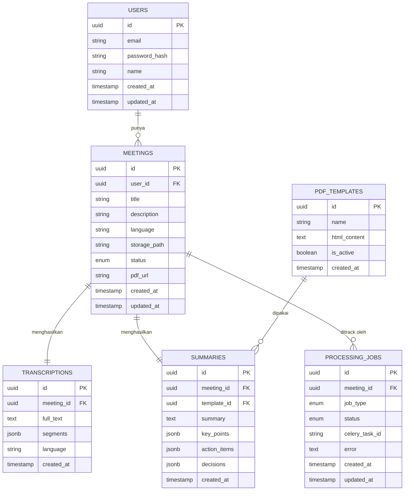

# ERD — Meeting Summarizer Database

Entity Relationship Diagram untuk skema database Meeting Summarizer.
Diagram di bawah ini otomatis ter-render di VSCode (extension Markdown Preview Mermaid)
maupun di GitHub.

> Catatan: field tabel `users` dan struktur kolom JSON (`segments`, `key_points`,
> `action_items`, `decisions`) masih asumsi dari diagram arsitektur. Konfirmasi ke Ndri
> (pemegang repositories/query) sebelum dianggap final.



## Ringkasan relasi

|Dari           |Ke               |Jenis|Arti                                                           |
|---------------|-----------------|-----|---------------------------------------------------------------|
|`users`        |`meetings`       |1 : N|satu user punya banyak meeting                                 |
|`meetings`     |`transcriptions` |1 : 1|satu meeting punya satu transkrip                              |
|`meetings`     |`summaries`      |1 : 1|satu meeting punya satu ringkasan                              |
|`meetings`     |`processing_jobs`|1 : N|satu meeting bisa punya banyak job (transcribe, summarize, pdf)|
|`pdf_templates`|`summaries`      |1 : N|satu template dipakai banyak ringkasan                         |

## Alur status `meetings.status`

```
UPLOADED → TRANSCRIBING → SUMMARIZING → GENERATING_PDF → COMPLETED
                                  ↘ (jika gagal di tahap mana pun) ↘ FAILED
```